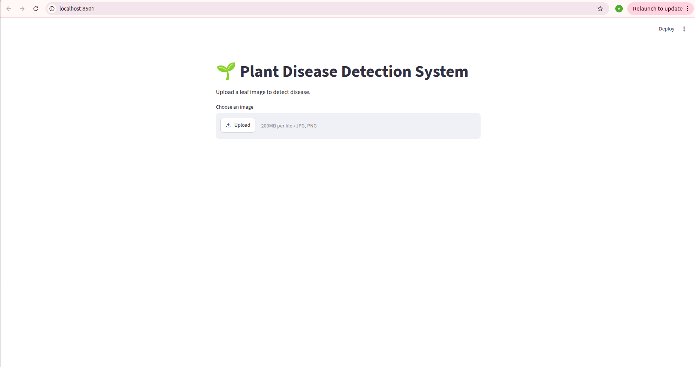
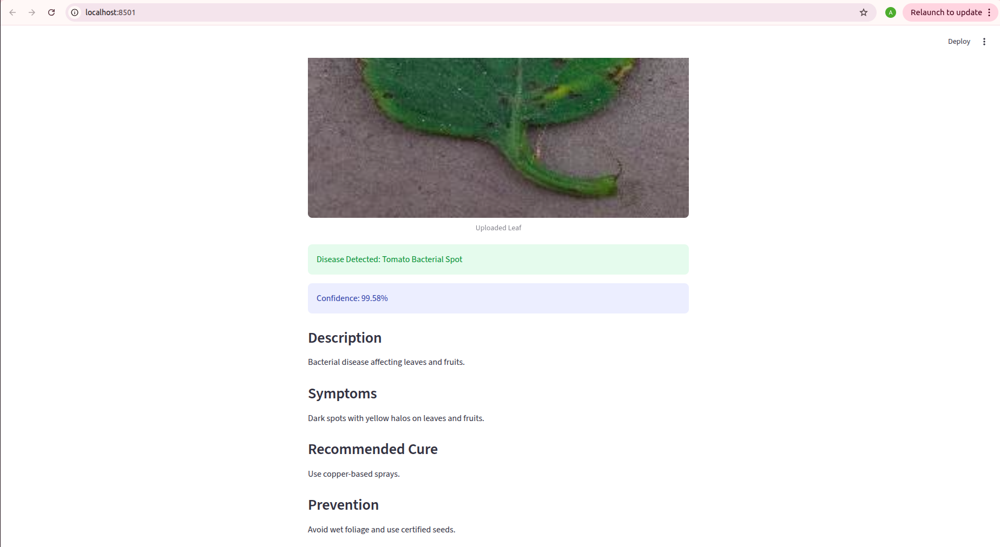

# Plant Disease Detection System

## Project Overview

The Plant Disease Detection System is a Deep Learning based application developed using Python, TensorFlow, and Streamlit. The system identifies plant leaf diseases from uploaded images and provides information about the detected disease, including symptoms, treatment recommendations, and preventive measures.

The model is trained on the PlantVillage dataset containing over 20,000 images across 15 different disease categories of Tomato, Potato, and Bell Pepper plants.

This project aims to assist farmers and agricultural professionals in the early detection of plant diseases, helping reduce crop losses and improve productivity.

## Features

* Upload plant leaf images through a web interface.
* Detect diseases using a Convolutional Neural Network (CNN).
* Support for 15 disease categories.
* Display prediction confidence score.
* Provide disease description.
* Show symptoms of the detected disease.
* Recommend treatment methods.
* Suggest preventive measures.
* User-friendly Streamlit interface.
* Real-time image classification.

## Tech Stack

* Python
* TensorFlow
* Keras
* NumPy
* Pillow (PIL)
* Streamlit
* Visual Studio Code (VS Code)

## Dataset Information

* Dataset: PlantVillage Dataset
* Total Images: 20,638
* Disease Categories: 15
* Plant Types:

  * Tomato
  * Potato
  * Bell Pepper

## Model Performance

* Training Accuracy: 83.76%
* Validation Accuracy: 85.36%
* CNN-based image classification model
* 15 disease classes

## Project Structure

```text
PlantDiseaseDetection/
│
├── app.py
├── train.py
├── predict.py
├── disease_info.py
├── requirements.txt
├── README.md
│
├── models/
│   └── plant_disease_model.keras
│
├── screenshots/
│
└── dataset/
```

## How to Run

```bash
git clone <repository-url>
cd PlantDiseaseDetection

python -m venv venv
source venv/bin/activate

pip install -r requirements.txt

streamlit run app.py
```

Open:

```text
http://localhost:8501
```

## Screenshots

### Home Page



### Prediction Result



## Future Enhancements

* Mobile application integration
* Cloud deployment
* Transfer Learning using MobileNetV2 / ResNet50
* Support for additional plant species
* Real-time camera detection

